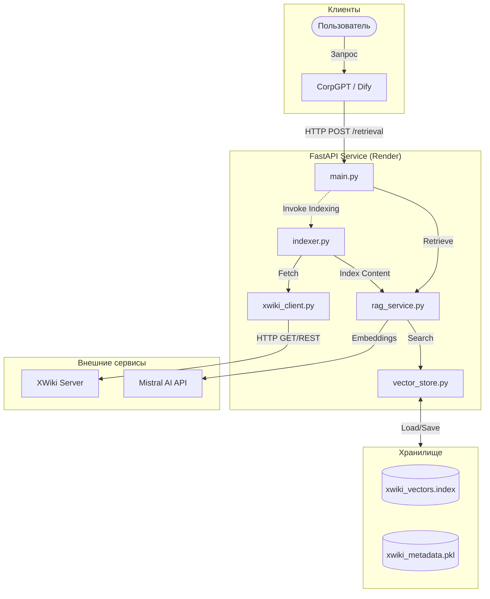
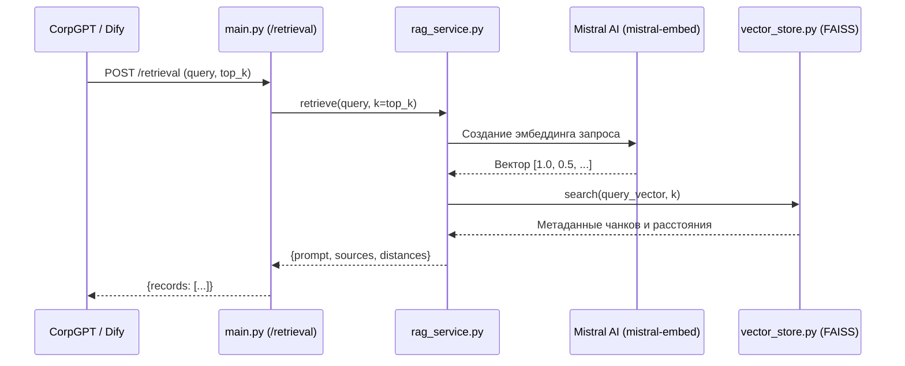
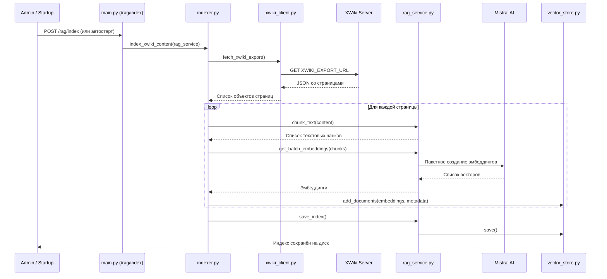

# CorpGPT XWiki RAG Service

FastAPI‑сервис, который подключает внешнюю базу знаний XWiki к CorpGPT через семантический поиск (RAG) на основе Mistral Embeddings и FAISS.

***

## Возможности

- Импорт документации из XWiki (plain export).
- Разбиение страниц на чанки и индексация во векторном хранилище (FAISS).
- Семантический поиск по базе знаний (учитывает формы слов и перефразировки).
- Интеграция с CorpGPT через специальный endpoint `/retrieval`.
- Защищённый endpoint для переиндексации (`/rag/index` с API‑ключом).

***

## Архитектура

- **FastAPI** — HTTP‑сервис.
- **Mistral Embeddings** — векторизация текста XWiki и запросов.
- **FAISS** — векторная база для nearest‑neighbor поиска.
- **XWiki** — источник знаний, экспорт через `XWIKI_EXPORT_URL`.
- **Render** — хостинг сервиса и авто‑индексация при старте.

***

## Основные модули

- `main.py`  
  - `GET /` — статус сервиса.  
  - `GET /health` — health‑check.  
  - `POST /rag/index` — индексация XWiki (требует заголовок `x-api-key: ADMIN_API_KEY`).  
  - `POST /rag/query` — семантический retrieval: промпт + источники + расстояния.  
  - `POST /retrieval` — адаптер под CorpGPT (возвращает `records` в ожидаемом формате).

- `rag_service.py`  
  - Инициализация Mistral клиента и FAISS‑хранилища.  
  - `retrieve(query, k)`:
    - строит эмбеддинг запроса,
    - ищет релевантные чанки в FAISS,
    - формирует `context`, промпт и список `sources` с текстом чанков.

- `indexer.py`  
  - Загрузка контента XWiki через `fetch_xwiki_export()`.  
  - Фильтрация пустых/коротких страниц.  
  - Разбиение в текстовые чанки.  
  - Пакетное создание эмбеддингов и запись в FAISS.  
  - Сохранение индекса на диск.

***

## Переменные окружения

Обязательные:

- `MISTRAL_API_KEY` — ключ для Mistral API.
- `XWIKI_EXPORT_URL` — URL экспорта XWiki (plain JSON).  
- `ADMIN_API_KEY` — секрет для доступа к `/rag/index`.

Опциональные:

- `XWIKI_BASE_URL`, `XWIKI_USERNAME`, `XWIKI_PASSWORD` — доступ к XWiki REST.  

***

## Работа с индексом

### Ручная индексация

```bash
curl -X POST https://<your-service>/rag/index \
  -H "x-api-key: <ADMIN_API_KEY>"
```

### Авто‑индексация

При старте сервиса:

- Если векторный индекс пустой, автоматически вызывается `index_xwiki_content` и все страницы XWiki переиндексируются.

***

## Интеграция с CorpGPT

В CorpGPT:

- Внешняя база знаний `xWiki` настроена на вызов endpoint`а:

  ```text
  POST https://<your-service>/retrieval
  ```

- Сервис ожидает `RetrievalRequest` и возвращает `records` с полями:
  - `title` — заголовок страницы,
  - `content` — текст чанка,
  - `metadata.path` — URL XWiki,
  - `score` — релевантность (на основе расстояния в векторном пространстве).

Благодаря семантическому поиску:

- Запросы вроде `систему блокирует` корректно находят статьи, где текст в базе «система блокирует».

***

## Локальный запуск

```bash
pip install -r requirements.txt

export MISTRAL_API_KEY=...
export XWIKI_EXPORT_URL=...
export ADMIN_API_KEY=...

uvicorn main:app --reload
```

Индексация:

```bash
curl -X POST http://localhost:8000/rag/index \
  -H "x-api-key: $ADMIN_API_KEY"
```

Проверка RAG:

```bash
curl -X POST "http://localhost:8000/rag/query?question=equipment%20status&k=2"
curl -X POST "http://localhost:8000/rag/answer?question=систему%20блокирует&k=3"
```


---

## Архитектура и рабочие процессы

Сервис реализует классический RAG (Retrieval-Augmented Generation) пайплайн поверх XWiki. CorpGPT вызывает этот сервис через webhook `/retrieval` для получения релевантных фрагментов знаний по запросу пользователя.

### 1. Общая архитектура компонентов



### 2. Процесс выполнения запроса (Retrieval Flow)

Детальная последовательность шагов при получении вопроса от CorpGPT.



### 3. Процесс индексации (Indexing Flow)

Фоновый процесс наполнения векторной базы данными из XWiki.



### Ответственность модулей

- **`main.py`** — HTTP API и интеграционный слой (FastAPI приложение, health checks, `/rag/index`, `/rag/query`, `/rag/answer`, `/retrieval`), плюс опциональная авто-индексация при старте.
- **`rag_service.py`** — основная RAG логика: вспомогательные функции для чанкования, вызовы эмбеддингов Mistral, поиск по сходству через векторное хранилище и конструирование промптов для генерации ответов.
- **`indexer.py`** — пакетная индексация знаний из XWiki: запускает полный пайплайн от экспорта XWiki до заполненного FAISS индекса.
- **`vector_store.py`** — абстракция над FAISS: добавление/поиск эмбеддингов и управление персистентностью индекса и связанных метаданных на диске.
- **`xwiki_client.py`** — многофункциональный адаптер для работы с XWiki:
  - `fetch_xwiki_export()` — загружает JSON-экспорт всех страниц из `XWIKI_EXPORT_URL` с поддержкой `strict=False` для обработки нестандартного JSON.
  - `chunk_text()` — разбивает текст на чанки с перекрытием (overlap), умно ищет границы по переносам строк и точкам для сохранения контекста.
  - `search_xwiki_raw()` — выполняет поиск по XWiki REST API (`/rest/wikis/xwiki/search`) с параметрами `scope=name,content`.
  - `enrich_xwiki_results()` — обогащает результаты поиска: загружает HTML каждой страницы, извлекает основной контент через regex по классам (`xwikidoccontent`, `xwiki-content`), очищает от HTML-тегов и служебных блоков (комментарии, вложения), фильтрует по наличию кириллицы и минимальной длине предложений.
  - Поддержка аутентификации через `XWIKI_USERNAME` и `XWIKI_PASSWORD`, построение корректных `bin/view` URL из иерархии страниц.
